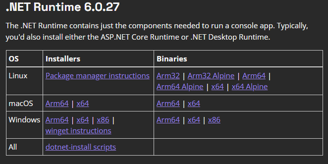

<h1 align="center">Desafio - Separador de Endereços</h1>

## :memo: Descrição
Recebe uma string do endereço contendo logradouro e número, e separa em duas strings, sendo uma para número e outra para o logradouro.


## :wrench: Tecnologias utilizadas
* C#
* .NET 6
* xUnit

<!-- ## :rocket: Rodando o projeto -->

<!-- ### Pelo executável
Para rodar o repositório é necessário clonar o mesmo, dar o seguinte comando para iniciar o projeto:
```
<linha de comando>
``` -->

<!-- ## :white_check_mark: Testes do Projeto -->


## ⚡ Executando a aplicação

* Instalar o runtime do .NET 6 ([Link Oficial Microsoft](https://dotnet.microsoft.com/en-us/download/dotnet/6.0))



### Utilizando a aplicação com o executável:

* Abrir o arquivo: SeparadorDeEnderecos\DesafioEndereco\publish\DesafioEndereco.Console.exe


## 🧪 Executando os testes

Observação: Para rodar os testes é necessário instalar o SDK do .NET 6

* SDK .NET 6 - [Link Oficial Microsoft](https://dotnet.microsoft.com/en-us/download/dotnet/6.0)

#### Executando pelo Visual Studio


#### Executando pelo terminal:
  ```
  cd SeparadorDeEnderecos/DesafioEndereco/DesafioEndereco.Tests/
  ```
  ```
  dotnet test
  ```
